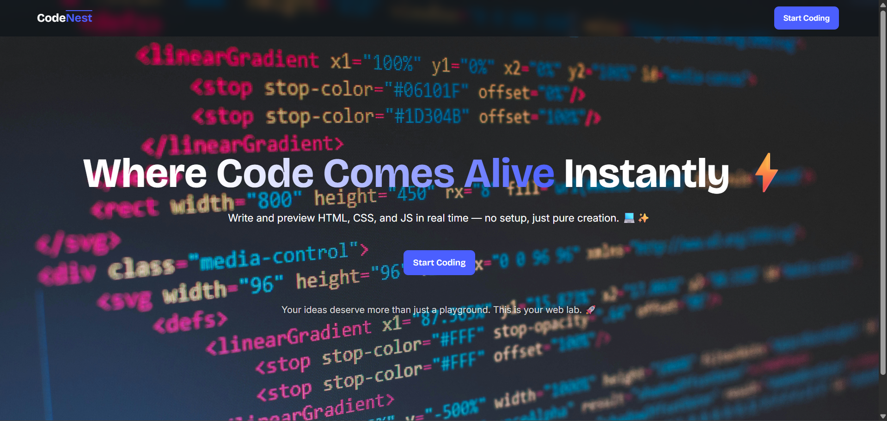
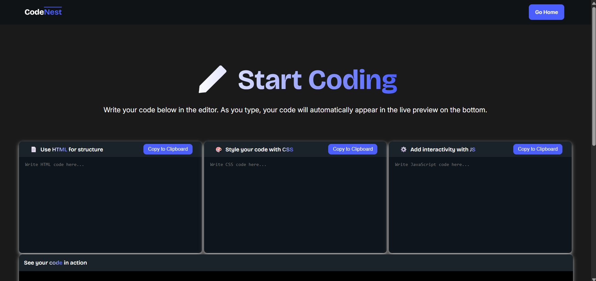

# CodeNest Editor 🛠️

Welcome to **CodeNest Editor**, your lightweight, fast, and user-friendly online code editor supporting HTML, CSS, and JavaScript. This project provides a simple, interactive platform for coding enthusiasts to write, test, and preview their web development projects instantly.

## Live Preview 🌐

You can check out the live version of this project here: **[Live Preview](https://codenesst.netlify.app/)**

## Features ✨

-   **Live Preview:** See your code come to life as you type.
-   **Responsive Design:** Code and preview on any device, from desktops to mobiles.
-   **Copy Code:** Easily copy your work and use it anywhere.

## Screenshots 📸

**Homepage:**

**Editor Page:**

## Usage 💻

1.  **Start Coding:** Write your HTML, CSS, and JavaScript code in the respective sections of the editor.
2.  **Live Preview:** Watch your code render instantly in the live preview section.
3.  **Copy Code:** Copy your code to your local machine for further use or deployment.

## Acknowledgments 🙏

-   **Icons:** [FontAwesome](https://fontawesome.com/)
-   **Design Inspiration:** Design is heavily inspired from Osnit Newsletters Website.

